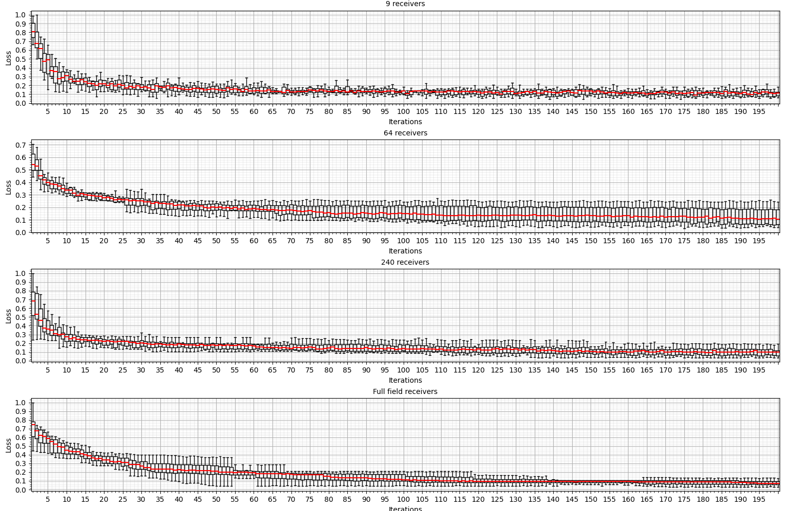
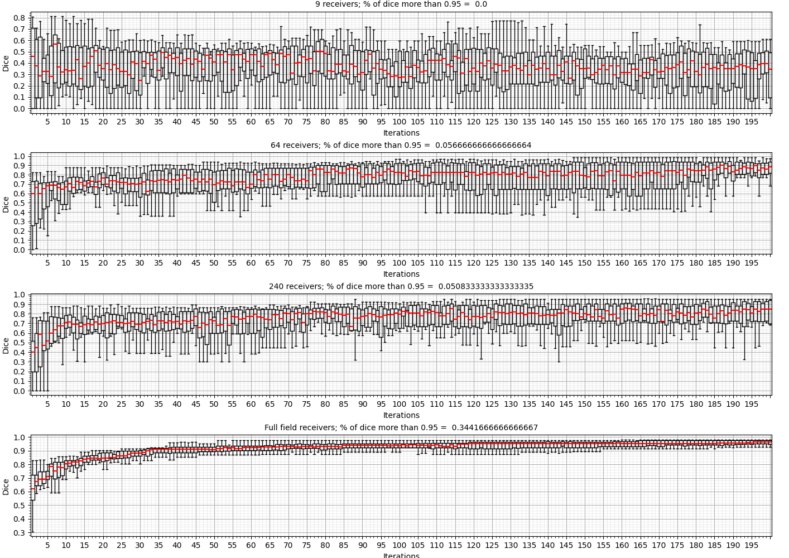
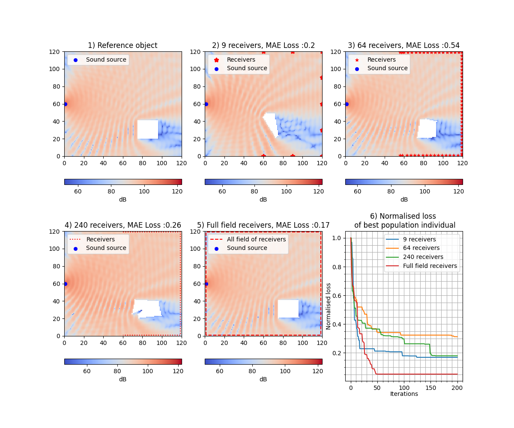
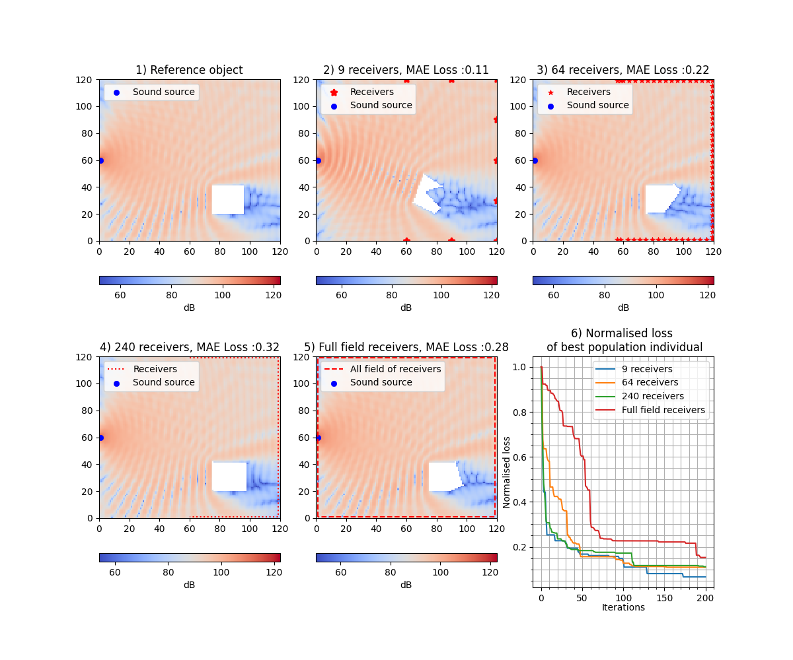
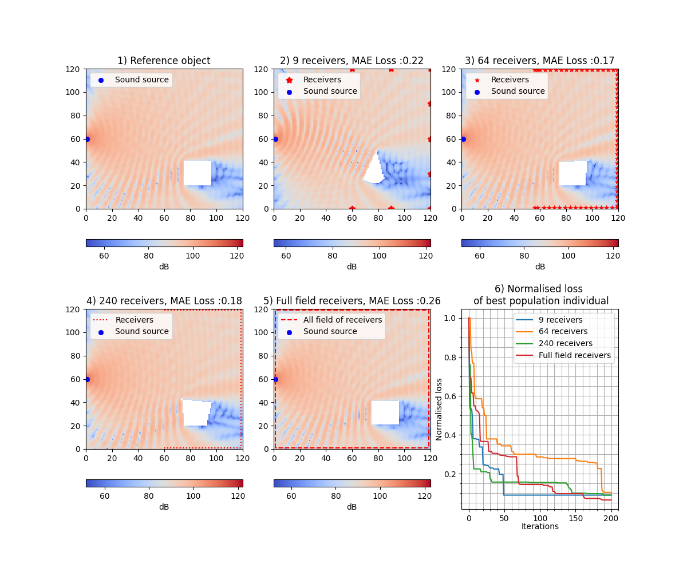
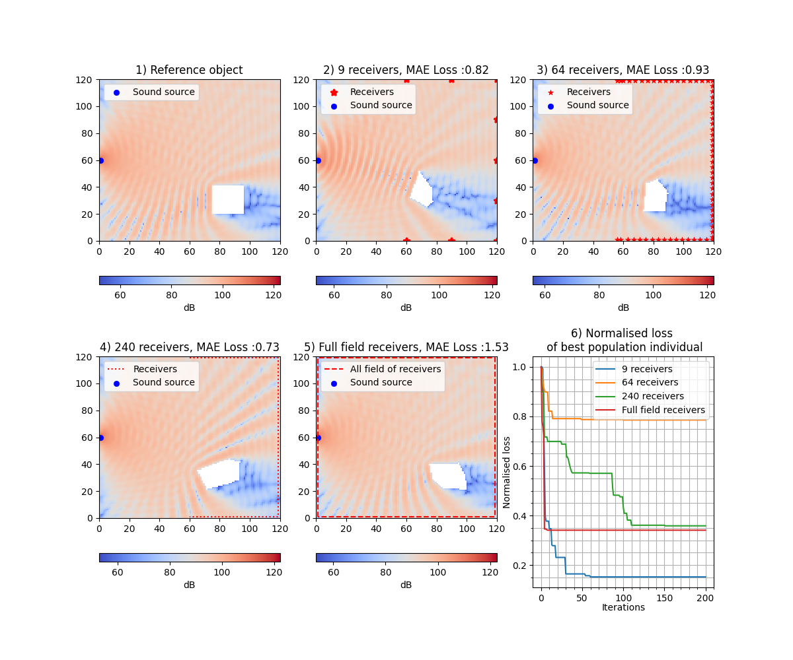
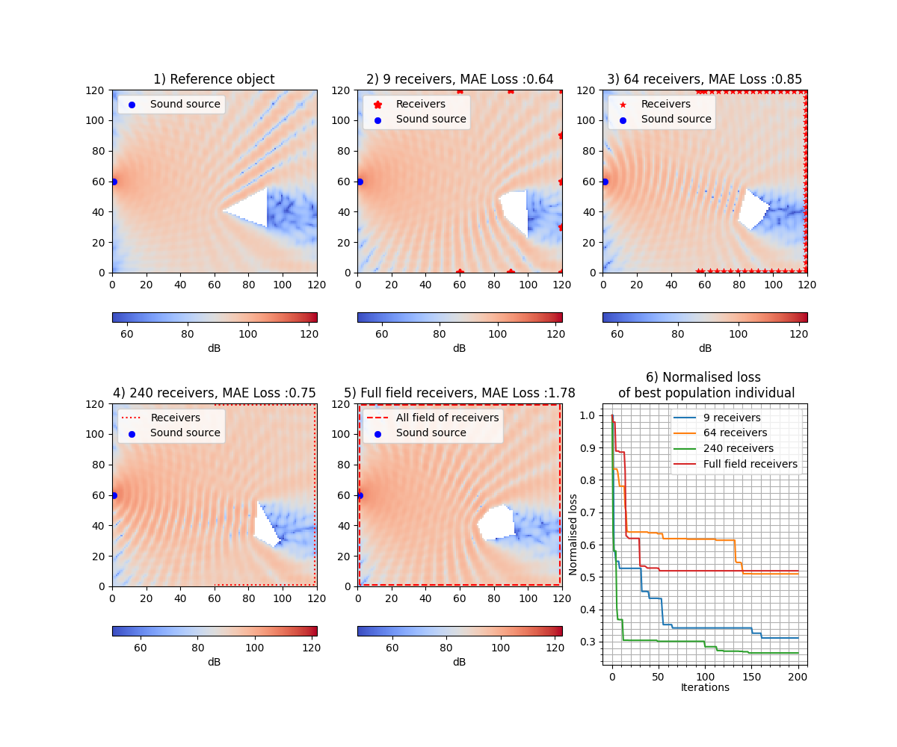
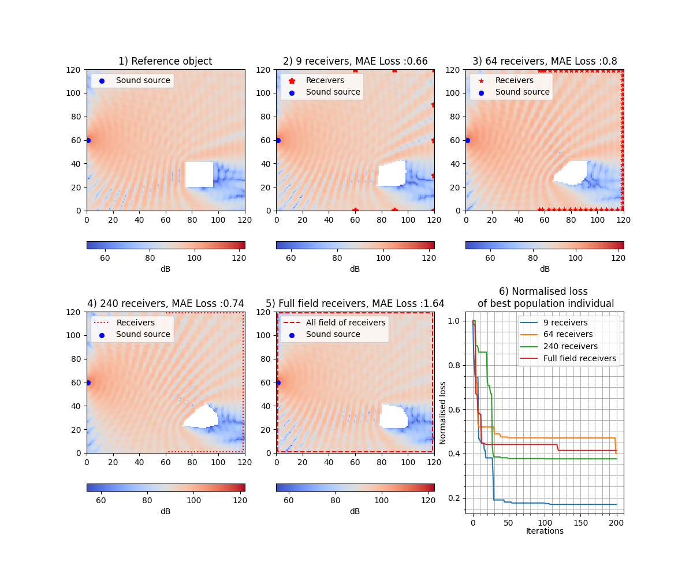

# Repository for "Evolutionary Generative Design for Defects Shape Reconstruction using Acoustic Measurements" paper submitted to" IEEE International Conference on Acoustics, Speech, and Signal Processing (ICASSP 2024)" conference
### In the paper, the generative design approach implemented in [GEFEST](https://github.com/aimclub/GEFEST) framework was applied to improve optimization process of defect reconstruction problem.
### This experiments can execute with Python 3.10.0 enviroment.
 - *main_experiment.py* file includes the code which executes the main experiment mentioned in the paper. This file create *Results* folder.
 - *baseline_experiment.py* file includes the code which executes the baseline experiment in the paper.  This file create *Baseline_results* folder.
 - *Paper_results*  folder contain all results of paper's experiments.
 - *vizualization* folder contain files *Historys_visualisation.py*(plot a reconstructed shapes and loss of optimization) and *evo_results_df.py* (create a DataFrame with loss and dice). To vizualize results in this files, string *path_to_result* can specify the path from the repository root to the experiments.
   
Installation
------------
To run cases of this repo, need to install GEFEST it's requirements packages.

It's can be installed with ``pip``::

``$ git clone https://github.com/ITMO-NSS-team/GEFEST_sound_detection_paper_experiments.git``  
``$ cd GEFEST_sound_detection_paper_experiments``  
``$ pip install -r requirements.txt``

Visualisation of optimisation
------------

Other result that not presented in paper
------------

### Loss box-plot

### Dice box-plot

### Proposed approach experiments plots

### Baseline plots

